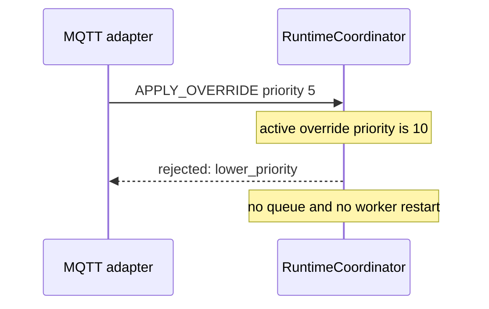
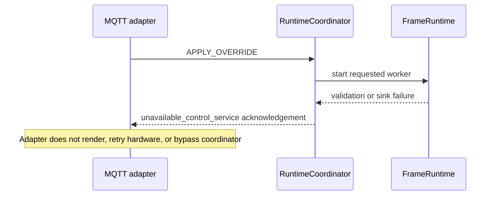

# Runtime command contract

`RuntimeCommand` is the source-neutral command passed to `RuntimeCoordinator`. It contains `source`, `action`, non-empty `request_id`, optional `effect`, validated `parameters`, optional `output`, non-negative `priority`, and optional positive `duration_seconds`.

The coordinator validates effect parameters through the authoritative effect schema catalogue, serializes transitions under one lock, and owns the baseline/override state. MQTT adapter commands must use `CommandSource.MQTT`.

## Command table

| Action | Valid sources | Required fields | Transition / worker effect | Success | Rejection conditions |
|---|---|---|---|---|---|
| `SET_BASELINE` | Browser, REST, CLI, system; **not MQTT** | `effect`, schema-valid `parameters`; output may be omitted for server default | Replaces baseline. If no override is active, stops/restarts worker on new baseline; otherwise preserves active override. | New baseline recorded; effective display is override or baseline. | Missing/unknown effect, invalid parameters/output, runtime start failure. |
| `APPLY_OVERRIDE` | Browser, REST, MQTT, system | `effect`, schema-valid parameters, positive `duration_seconds` for MQTT; non-negative priority | Preserves baseline, replaces effective display, stops/restarts worker on override. Output inherits baseline for MQTT. | Override recorded with expiry. | No inheritable baseline output, invalid effect/parameters/duration, lower priority than active override, runtime failure. Lower priority is rejected, never queued. |
| `CANCEL_OVERRIDE` | Browser, REST, MQTT adapter policy, system | `request_id`; no effect required | Clears override and stops/restarts worker on baseline from time zero. | Baseline becomes effective. | No active override. |
| `RESTART_BASELINE` | Browser, REST, CLI, system; **not MQTT** | `request_id`; no effect required | Clears override and stops/restarts baseline from time zero. | Baseline is effective. | No baseline configured. |
| `STOP_ALL` | Browser, REST, CLI, system; **not MQTT** | `request_id`; no effect required | Clears baseline and override; stops worker. | Coordinator is idle. | Unsupported action/runtime failure. |

`GET_STATUS` is read-only and is not an MQTT command action in v1.

## State-transition table

| Current state | Input | Resulting baseline | Resulting override | Effective display | Worker |
|---|---|---|---|---|---|
| idle | set baseline | new baseline | none | baseline | starts |
| baseline | apply accepted override | unchanged | new override | override | restarts |
| override | lower-priority override | unchanged | unchanged | existing override | unchanged |
| override | equal/higher override | unchanged | replacement override | replacement | restarts |
| override | expiry or cancel | unchanged | none | baseline | restarts from zero |
| baseline or override | stop all | none | none | none | stops |
| baseline | finite natural completion | none | none | none | becomes idle |

## Sequences

### Normal MQTT override and expiry

```mermaid
sequenceDiagram
  participant M as MQTT adapter
  participant V as Validator
  participant C as RuntimeCoordinator
  participant R as FrameRuntime
  M->>V: override envelope
  V->>C: APPLY_OVERRIDE source=MQTT, inherited output
  C->>R: stop baseline worker; start temporary override
  C-->>M: accepted acknowledgement
  Note over C: duration expires
  C->>R: stop override worker; restart baseline at t=0
```

### Lower-priority rejection



### Operator cancellation

```mermaid
sequenceDiagram
  participant B as Browser operator
  participant C as RuntimeCoordinator
  participant R as FrameRuntime
  B->>C: CANCEL_OVERRIDE
  C->>R: stop override; restart baseline at t=0
  C-->>B: accepted
```

### Higher-priority replacement

```mermaid
sequenceDiagram
  participant M as MQTT adapter
  participant C as RuntimeCoordinator
  participant R as FrameRuntime
  M->>C: APPLY_OVERRIDE priority 20
  Note over C: active override priority is 10
  C->>R: stop prior override; start replacement
  C-->>M: accepted
```

### Control-service failure



The existing runtime reports asynchronous worker failures in runtime status. An implementation should emit a stable service-unavailable acknowledgement when submission cannot be accepted, and may publish a later status/ack update when a started worker fails.