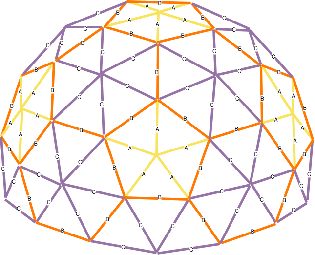

# Building the dome

This document contains the design notes, layout files and supporting documentation for building the dome itself.

The dome is a 3v 5/8 geodesic dome, 6 m in diameter and 3.5 m high. It is constructed with a dome kit from [Build With Hubs](https://buildwithhubs.co.uk/) using 165 broom handles of three different lengths, totalling over 181 metres.

## Contents

- [Assembly](#assembly)
- [Struts](#struts)
- [Hubs](#hubs)
- [Base](#base)
- [Build process](#build-process)
- [Additional notes](#additional-notes)

## Assembly

## Struts

| Strut | Count | Colour | Wood length | Centre-to-centre length |
| :---: | :---: | :----- | :---------- | :---------------------- |
| A     | 30    | Yellow | 950 mm      | 1,037 mm                |
| B     | 55    | Orange | 1,114 mm    | 1,201 mm                |
| C     | 80    | None   | 1,139 mm    | 1,226 mm                |

The wood length is 87 mm shorter to account for the space occupied by the hubs and ball connectors at the points.

There are 165 struts in total.

## Hubs

There are 61 hubs in total:

- Six 5-way hubs
- 55 6-way hubs

The bottom ring of 6-way hubs will only have four populated sockets.

## Base

The base ring is made up of five medium struts, ten long struts and 15 6-way hubs.

The base ring is 0.9837 times the master diameter of the dome because the 5/8 base section is slightly smaller than the diameter at the halfway point.

Ten of the base hubs will sit on a slightly higher plane. We have ten feet for the dome and attach them to these ten hubs, lifting the structure just clear of the ground.

We could also use two ball connectors in the spare sockets to connect the dome to a base.

## Build process

The dome will be self-supporting up to the 3/8 stage. This means we can build the dome to this level and then install the lights using a small step without having to work at height.

Two people can usually build the dome up to the last layer. The last layer can fold under because it is past the halfway point and starts to come back towards the centre of the dome. Three people are then needed to add the last layer: two to lift and one to connect.

Alternatively, you can build the 3/8 section to one side and lay out the base section in position. The 3/8 section can then be lifted and moved over the base while one person connects the base layer. This works quite well but requires at least five people.

## Additional notes

- [Build With Hubs help for 3v 5/8 domes](https://help.buildwithhubs.co.uk/2v3v/3v-58)
