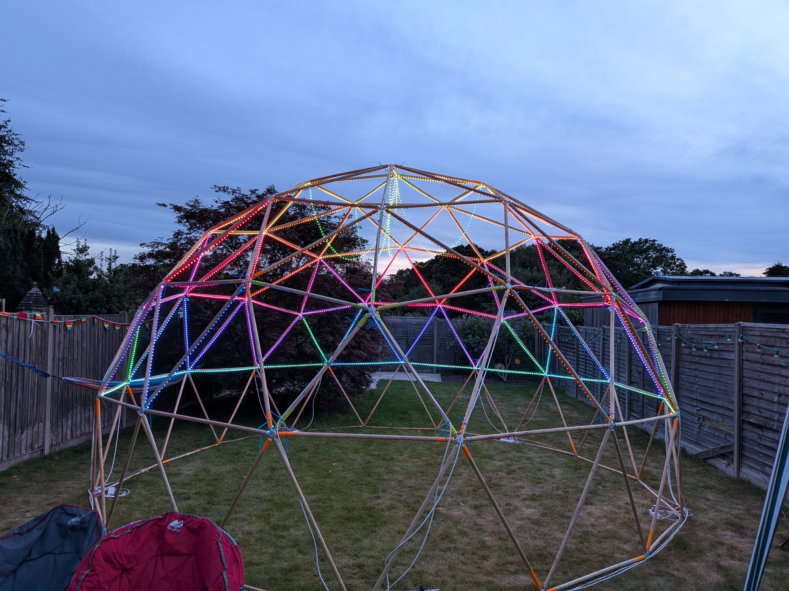

# Addressable LED Dome for Electromagnetic Field

Every two years Dogsbody Technology attends the [Electromagnetic Field festival](https://www.emfcamp.org/) which can only be described as Glastonbury for geeks; and WE LOVE IT!

Each time we try to build something and each event we try and go bigger and better.

In 2024 [we built a huge geodesic dome](https://www.dogsbody.com/blog/electromagnetic-field-2024-the-best-yet/) and in 2026 we are covering the entire thing in 150 meters of 5,000 individually addressable RGB LEDs for interactive lighting, patterns, games, and general tinkering! 

This repository should (hopefully) contain all the design notes, wiring plans, controller configuration, layout files, and supporting documentation for the project.

## Quick facts
- 6 metre diameter geodesic dome
- 165 wooden struts
- 5,000 WS2815 pixels
- Five 30 metre strings
- Five QuinLED Dig-Uno controllers
- Five 12V 100W power supplies
- WLED and Python software

## Explore the project
- [Building the dome](Dome.md)
- [Lighting and power](Lighting.md)
- [Software and interactive features](Software.md)
- [Tools List](Tools.md)

Licensed under the [MIT License](LICENSE)

