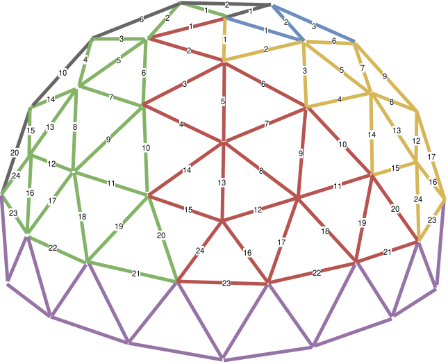

## This Directory
This directory should (hopefully) contain all the design notes, wiring plans, controller configuration, layout files, and supporting documentation for the lighting of the dome.

## Contents
- [LEDs](#leds)
- [Networking](#networking)
- [Layout](#layout)
- [Power](#power)
- [Controllers](#controllers)
- [WLED](#wled)

## LEDs
We went with WS2818 LEDS as these are 12V with a backup data line. They are RGB (not RGBW) however this should be fine for the dome as it's all about the colour.

We found some lovely waterproof LED's with black wire. A 30mm pitch means each length of 1000 LEDs is 30meters and is perfect for a controller each as well as a being the right size for the dome.

- 5 x [30mm Pitch WS2818 Pixel String DC12V 1000ct Pixels RGB IC Addressable IP67 Black Wire](https://www.aliexpress.com/item/1005009115166973.html?spm=a2g0o.cart.0.0.549b38dazIQOVE&mp=1&pdp_npi=6%40dis%21GBP%21GBP%2063.53%21GBP%2060.99%21%21GBP%2060.99%21%21%21%40211b615317761987215187255e9494%2112000047971421451%21ct%21UK%21750918518%21%214%210%21)

| Wire                                      | Heatshrink colour | 
| ----------------------------------------- | ----------------- |
| Ground / 0V                               | Black             |
| Backup Data line                          | Green             |
| Main Data Line                            | Yellow            |
| +12V (marked with a dot on the LED wires) | Red               |

Power injection points have been added to the end and middle of each string using the same coloured heatshrink. We should be able to reach full brightness this way.

**Important: The backup data line should be tied to GND so it is not floating.** The first LED in the line mirrors the signal if required.

## Networking
We have borrowed a router from Dan to do this.

- Gateway: 192.168.12.1
- Broadcast: 192.168.12.255
- Subnet Mask: 255.255.255.0
- DHCP Range: 192.168.12.200 - 192.168.12.254

| Controller # | Connection | MAC               | IP Addr       |
| :----------- | :--------: | :---------------: | ------------- |
| Controller 1 | WiFi       | 00:70:07:7f:bd:6c | [192.168.12.10](http://192.168.10) |
| Controller 1 | Wired      | 00:70:07:7f:bd:6f | [192.168.12.11](http://192.168.11) |
| Controller 2 | WiFi       | 00:70:07:7f:b2:34 | [192.168.12.20](http://192.168.20) |
| Controller 3 | WiFi       | 00:70:07:7f:b9:60 | [192.168.12.30](http://192.168.30) |
| Controller 4 | WiFi       | 20:e7:c8:6c:4b:b8 | [192.168.12.40](http://192.168.40) |
| Controller 5 | WiFi       | 00:70:07:7e:f5:5c | [192.168.12.50](http://192.168.50) |

There is a hidden ssid used with permission of the organisers.

**Important: Follow [the EMF guide regarding bringing wireless access points](https://www.emfcamp.org/about/internet#bringing-wireless-access-points).**

## Layout
The dome is large enough that five 30 metre strings of 1000 pixels are a good fit. The intended layout is five separate data paths from the top of the dome down to the lower structure, with each controller driving one complete string.

- Struts 1 to 12 = 14.2 meters
- Struts 13 to 24 = 13.8 meters
- Total = 28 meters

In reality it's easier to start at strut 24 and work backwards allowing 2 meters to then hang down from the centre of the dome.

We would love to come up with a layout so that one string starts where another string ends however this is unlikely to be feasible without doubling back due to the five pointed pentagons. We have left this as a project for another year :-)

Installing the LED's on the dome has yet to be worked out. I fear we may need to build the dome and then install the LEDs which means we need a ladder! The LED's don't go on the bottom struts so we can build the the dome up to the last layer, install the LEDs and then install the last layer however it WILL BE HEAVY!

- 500 x [5x200mm blue zip ties](https://www.aliexpress.com/item/1005004609102546.html?spm=a2g0o.detail.0.0.1ba2HaZXHaZXB1&mp=1&pdp_npi=6%40dis%21GBP%21GBP%203.68%21GBP%203.59%21%21GBP%203.59%21%21%21%40211b61ae17762036871267314e801f%2112000053124186326%21ct%21UK%21750918518%21%211%210%21)

## Power
Each 1000 pixel string is rated at approximately 100W, so the design uses one 12V 100W PSU per string.
- 5 x 12V 100W waterproof constant voltage drivers: [TGR-12V-100W-IP67](https://cpc.farnell.com/tiger-power-supplies/tgr-12v-100w-ip67/led-driver-100w-ip67-12v-dc-8/dp/PW05064)

The difference between running 12V DC and 230V AC over distances is HUGE (Nikola Tesla was right, suck it Edison). If we wanted to run DC from a central location to all points on the dome we would need to use 6mm² cable! 

According to the [WLED power calculator](https://wled-calculator.github.io/) the largest wire we need is 1.5 mm²

|                         | Start Injection  | Middle Injection | End Injection    |
| ----------------------- | ---------------  | ---------------- | ---------------- |
| Wire length             | 226 cm           | 300 cm           | 753 cm           |
| Min. wire cross-section | 0.5 mm² (AWG 20) | 1 mm² (AWG 17)   | 1.5 mm² (AWG 15) |
| Max. current            | 2.97 A           | 5.94 A           | 2.97 A           |
| Fuse rated value        | 4 A              | 7.5 A            | 4 A              |
| Fuse color              | pink             | brown            | pink             |
| Max. voltage drop       | 0.663 V          | 0.868 V          | 0.727 V          |

By having the 5 PSU's dotted around the dome we can keep DC runs short and we can use the same 1.5 mm² cable for the 230V AC runs to the PSUs.

- [1.5mm² 2 Core PVC Flex 3182Y - White - 100M Drum](https://www.tlc-direct.co.uk/Products/CA1dot5F2.html)
- 10 x [25V Aluminium Capacitor 1000UF](https://www.aliexpress.com/item/1005004400860497.html?spm=a2g0o.detail.0.0.12fe5D8g5D8gt0&mp=1&pdp_npi=6%40dis%21GBP%21GBP%202.63%21GBP%202.61%21%21GBP%202.61%21%21%21%402103847817762032518165181e3c64%2112000029045776767%21ct%21UK%21750918518%21%211%210%21)

**Important: Common ground everywhere. Capacitor should go as close to the first LED as possible and ensure correct polarity.**

## Controllers
We have decided on the [QuinLED-Dig-Uno](https://quinled.info/2018/09/15/quinled-dig-uno/) as it includes all the gubbins required to make the ESP32 work such as fuse, capacitor, logic convertor and de-bounce resistor.

- 4 x [QuinLED-Dig-Uno](https://shop.allnetchina.cn/products/quinled-dig-uno-v3r7-digital-led-controller?variant=39296748585062)
- 1 x [QuinLED-Dig-Uno with Ethernet](https://shop.allnetchina.cn/products/quinled-dig-uno-v3r7-digital-led-controller?variant=39297009713254)

All controllers have been flashed with the latest version of WLED compiled by QuinLED [WLED_16.0.0_Dig-Uno-V3.bin](controller/WLED_16.0.0_Dig-Uno-V3.bin).

**Important: Mount each Dig-Uno as close as possible to the start of its LED string, not next to the PSU. The data line is fragile, the power line is not.**

## WLED
All controllers have been setup identically except controller 1 which is the main controller for the operation

Controller configs have been dumped in [wled/](wled/) and should be kept up to date.

All controllers have been renamed 1-5 and had their fallback ssid changed so that we can identify them.

Controllers 2-5 just control their 1000 LEDs.

Controller 1 is setup to control all 5000 LEDs with the 4000 remore LED's being virtual outputs pointing to the IP addresses of the other controllers.

[https://kno.wled.ge/advanced/mapping/](https://kno.wled.ge/advanced/mapping/)

